# bamazon: Amazon-like storefront

## Overview
There are 2 parts to this application: A **customer** view and a **manager** view.  The Customer View application allows for the the customer to view all products, select and buy any in-stock products.  The Manager View application allows for a manager to view all products, view any low inventory products, add a new product or add to the inventory quantity of an existing product.

## Customer View: bamazonCustomer.js
:black_medium_small_square:	Run node bamazonCustomer.js at the command line, it will immediately display the product list from the database and ask the customer to enter the ID of the product they would like to buy.

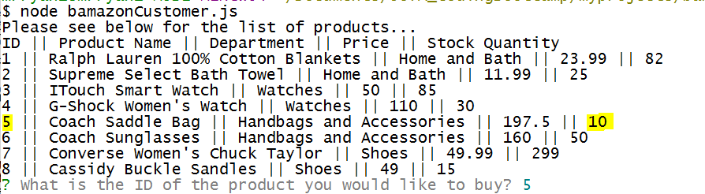

:black_medium_small_square:	Enter the ID # of the product to buy and it will display what the customer has chosen and how many are available for purchase.  Then ask how many the customer would like to buy.

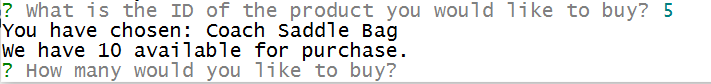

:black_medium_small_square: Enter the amount to buy and the application will show the total price and display the list of products again.  You can see the new stock quantity available has reduced by the amount purchased.

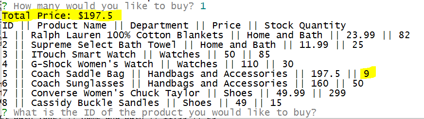

## Manager View: bamazonManager.js
The bamazonManager application is used by managers only.  The manager will have 4 options:
	1. View Products for Sale  - This option will list all the items available
	2. View Low Inventory - This option will list any items which have an inventory which is < 5
	3. Add to Inventory - This option allows the manager to select an item and add more to it's current inventory quantity
	4. Add New Product - This option allows the manager to add a complete new product

The manager can choose to exit the application by entering '5' when viewing the list of menu options.

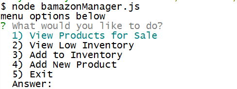

### View Products for Sale
Enter 1 to View all products in the database:
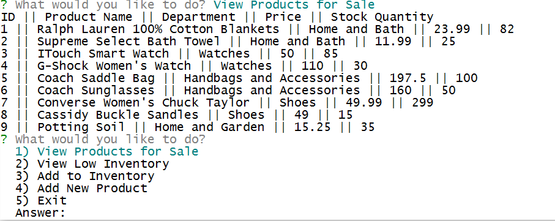

### View Low Inventory
Enter 2 to View any products which have an inventory count lower than 5:
 -- In this case there is no low inventory
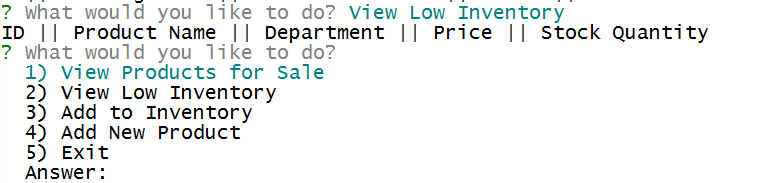

-- In this case there is 1 low inventory item
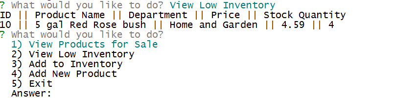

### Add to Inventory
Enter 3 to Add to inventory:
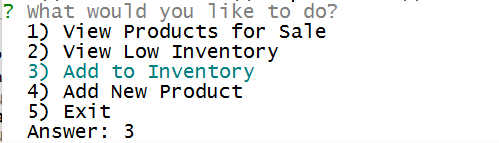

Choose an ID for the item you would like to add inventory:
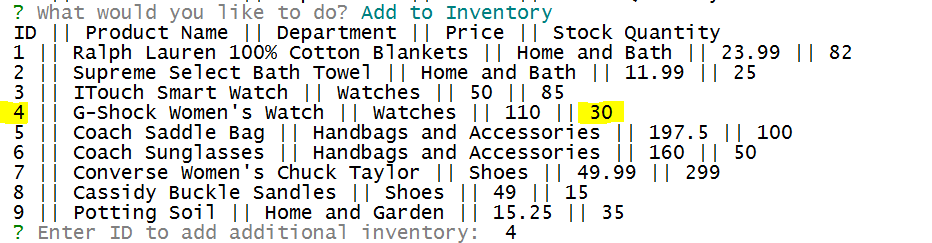
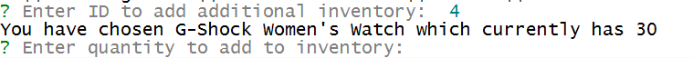

Then enter the additional quantity to add.  In this case our product currently had a stock quantity of '30', we will add '5' and our new quantity is '35'
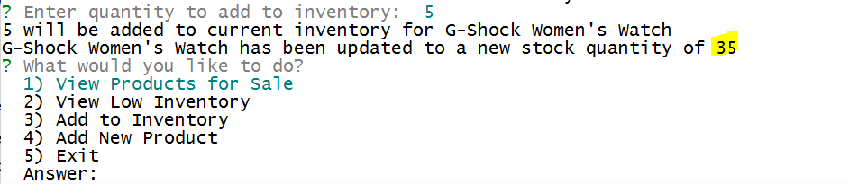

View the products again to see the table has been updated:
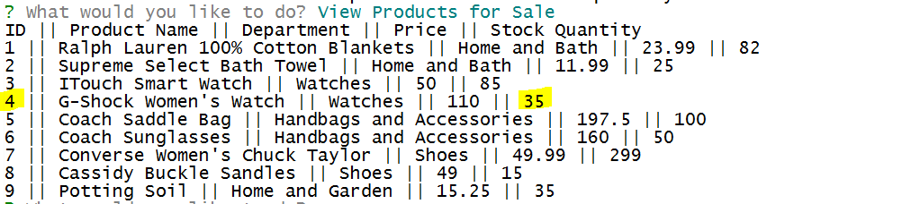

### Add New Product
To add a brand new product Enter '4' at the Answer: 
[add prod1](screenshots/manager-addprod1.png)

Enter in the information for the new product:
[add prod1](screenshots/manager-addprod2.png)

View the products again to show the new product has been added:
[add prod1](screenshots/manager-addprod3.png)

**Enter '5' to exit the application at any time.**